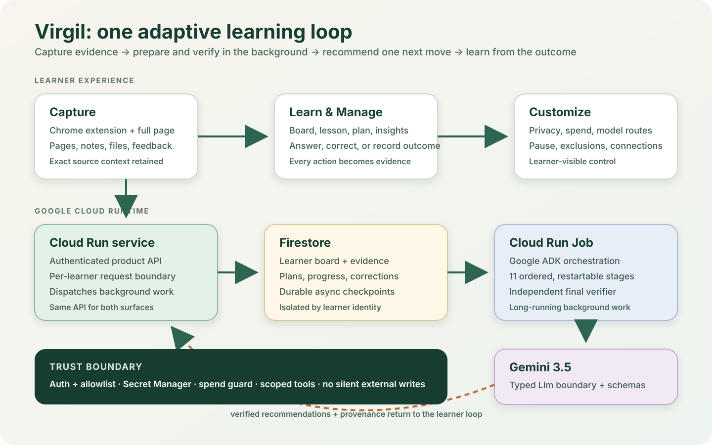

# Virgil

[](https://github.com/bharthamk/virgil/actions/workflows/verify.yml)
[](LICENSE)

**Pin what matters. Learn it where you are.**

Virgil stays by your side while you browse. See something worth understanding,
highlight it, and pin it without breaking your flow. Virgil keeps the exact
passage, source, and surrounding context so you can learn it immediately in the
side panel—or return when you have time.

When you are ready to learn, the same pin can move across the surface that fits
the moment: a quick explanation from Virgil, a prepared lesson on the full
Virgil page, a handoff to Gemini, a WebMCP-compatible assistant, or a grounded
Google Notebook session. Your answers, corrections, deadlines, and outcomes
then change what Virgil recommends next.

Bookmarks remember *where*. Chat remembers *what you asked*. Virgil remembers
what you encountered, what you understood, and what would be useful to do next.



## The product loop

1. **See it.** Select a passage, page, video moment, note, file, or course item.
2. **Pin it.** Virgil preserves the source receipt and enough nearby context to
   keep the idea meaningful.
3. **Learn it anywhere.** Stay in the side panel, open the full learning page,
   or hand the context to Gemini, WebMCP, or Google Notebook.
4. **Respond.** Answer a question, challenge the explanation, record an outcome,
   or say that now is not the time.
5. **Get a better next move.** Virgil updates its learner model and recommends
   one useful action for the time available.

The loop is the product: captured evidence changes the lesson, and the lesson's
outcome changes the next recommendation.

## What you can do

| Surface | Best for | Capabilities |
| :--- | :--- | :--- |
| Browser side panel | Learning without leaving the page | Pin a selection, take a 1/3/5-minute lesson, ask a bounded follow-up, answer, correct, or defer |
| Full Virgil page | Managing the whole learning picture | Board, prepared lessons, studies, plans, deadlines, insights, privacy, model routes, and backups |
| Gemini handoff | Open-ended exploration | Copies a source-grounded prompt and opens Gemini only after an explicit learner action |
| WebMCP | Agent-assisted work in the browser | Exposes narrow, schema-checked tools over the same authenticated Virgil state |
| Google Notebook | Deep work across saved material | Maintains three stable learner-facing source documents: learn now, on the board, and archive |

Virgil also reviews drafts without rewriting them, marks work against supplied
criteria, extracts editable text from scanned rubrics, and turns course material
into proposals that remain drafts until the learner confirms them.

## Try the included demo

The repository includes a synthetic, public-safe learner board. You can inspect
the product without an account, a model key, or network access.

Requirements: Node.js 22 or 24 LTS and npm.

```bash
npm ci
npm run build
node runner/dist/service.js
```

Open `http://127.0.0.1:8791/app/`, then follow:

```text
Board → IAM Condition Expressions → Learn → answer or “This is wrong” → Board / Insights
```

The included state makes the full evidence loop reviewable. Features that need
a live model remain unavailable until you configure one; they do not silently
fall back to an unknown provider.

Run the full offline release gate before changing or deploying the product:

```bash
npm test
npm run check:quality
npm run check:public
npm run check:deps
npm run check:seam
npm run check:d1
```

`npm test` is the source of truth for the current suite totals. The public
release check scans tracked content and Git history for credentials, personal
paths, private endpoints, and internal build artefacts.

## How Virgil works

Virgil separates interactive work from slower preparation. Foreground agents
handle capture, tutoring, review, marking, transcription, and course intake.
An eleven-stage nightly workflow prepares the board in a deterministic order:

```
intake → forage → cluster → survey → analyse → comfort → statements → prospect → garden → compose → verify
```

The final Verifier checks every composed section against its source material.
Unsupported sections are withheld before they reach the learner. The system can
shorten or refuse an answer when evidence is thin; it does not invent material
to fill a requested duration.

The fifteen-agent fleet shares five typed ports:

- `Llm` for every model call
- `Store` for persistence
- `Research` for outside-world reads
- `Embedder` for vector operations
- `Clock` for deterministic time

`core/` imports no provider SDK. Adapters supply Gemini, Vertex AI, Ollama,
Firestore, local JSON, Drive, and embedding implementations. Composition roots
choose a provider explicitly; the domain layer does not know which one runs it.

## Google stack

- **Gemini API / Vertex AI:** typed structured generation behind one model
  boundary. The default cloud routes use `gemini-3.5-flash-lite` for fast work
  and `gemini-3.7-flash` for deep work.
- **Google ADK:** hosts the ordered background workflow as a real
  `SequentialAgent`, while core agent functions remain framework-independent.
- **Cloud Run:** serves the authenticated product API and full-page experience.
- **Cloud Run Jobs:** executes restartable per-learner background work.
- **Firestore:** stores isolated learner boards, evidence, receipts, and durable
  checkpoints.
- **Firebase Authentication:** establishes learner identity for hosted installs.
- **Google Drive:** optionally maintains stable Google Docs for Notebook use.

The extension and full page use the same API and learner state. There is no
second browser-only database to reconcile.

## Trust model

Learning software should be especially careful about inference. Virgil makes
that boundary visible:

- the learner's own words outrank machine-derived observations;
- every teaching section retains provenance back to its pins;
- corrections can withdraw derived confidence and retire unsupported teaching;
- handoffs and external writes require an explicit learner action;
- untrusted page text, documents, and learner text are fenced before model use;
- hosted boards are separated by verified learner identity;
- model spend has an operator ceiling and a visible learner-controlled route;
- backup and deletion include derived state, not only raw pins;
- secrets and deployment-specific identifiers are never committed.

Virgil is self-hosted. Operators own their Google Cloud project, OAuth clients,
model credentials, and learner data. The repository does not point to a shared
private deployment.

See [SECURITY.md](SECURITY.md) for reporting and deployment guidance.

## Repository map

| Path | Responsibility |
| :--- | :--- |
| `core/` | Provider-independent domain types, agents, policies, and evaluations |
| `adapters/` | Model, store, research, Drive, and embedding implementations |
| `runner/` | HTTP service, CLI, model routing, budgets, and batch pipeline |
| `extension/` | Manifest V3 side panel, capture flow, and hosted-page shell |
| `adk/` | Google ADK host for the nightly workflow |
| `trigger/` | Pub/Sub message boundary and trigger service |
| `deploy/` | Reviewed Cloud Run, Cloud Run Jobs, Firestore, and Firebase configuration |
| `scripts/` | Quality, packaging, evaluation, benchmark, and acceptance tools |
| `benchmarks/` | Checked-in benchmark fixtures and result summaries |
| `docs/` | Architecture and durable project documentation |

## Configuration

The demo defaults to a local JSON store at `.data/store.json` and port `8791`.
Useful development settings include:

| Variable | Purpose |
| :--- | :--- |
| `SB_PORT` | Local service port; Cloud Run's `PORT` takes precedence |
| `SB_DB` | Local JSON store path |
| `SB_LLM` | Model provider and optional tier mapping (`gemini`, `vertex`, `ollama`, or `cli`) |
| `GEMINI_API_KEY` | Gemini API credential; supply through the environment or Secret Manager |
| `SB_EMBEDDER=tfidf` | Network-free local embedding mode |
| `SB_ORCHESTRATOR=adk` | Run the background workflow through Google ADK |
| `SB_STORE` | Select local JSON or a project-qualified Firestore store |
| `SB_AUTH` | Select the hosted identity boundary |
| `SB_OPERATOR_MODEL_BUDGET_TOKENS` | Required model-spend ceiling for authenticated hosted installs |

Never commit `.env` files, rendered deployment files, credentials, OAuth
tokens, or packaged extension output.

## Install and deploy

[INSTALL.md](INSTALL.md) is the supported self-hosting path. It covers:

1. Firebase Authentication and separate Web/Chrome OAuth clients
2. Secret Manager and the model-key boundary
3. no-write deployment planning
4. Cloud Run service and Job deployment
5. stable extension ID generation and packaging
6. first-user identity and board-isolation acceptance

Deployment scripts require the explicit `VIRGIL_DEPLOY=yes` opt-in before they
create or change cloud resources.

## Engineering standards

The build enforces more than compilation:

- strict TypeScript project references across six workspaces;
- coverage floors and structural quality limits;
- provider-seam purity for `core/`;
- deterministic D1 partition-equivalence checks;
- public-release privacy and secret scanning;
- a dependency audit that blocks high and critical advisories;
- source-grounding, prompt-injection, Unicode-boundary, idempotency, auth,
  quota, deletion, and failure-path contracts;
- a single Linux CI job that runs the same commands documented above.

Live-provider and emulator tests are explicit opt-ins. The offline gate never
pretends that a skipped credentialed test passed.

## Contributing

Read [CONTRIBUTING.md](CONTRIBUTING.md) before opening a change. Keep the domain
provider-independent, add a regression test for behavior changes, and run the
complete offline gate before submitting a pull request.

## License

Apache License 2.0. See [LICENSE](LICENSE).
