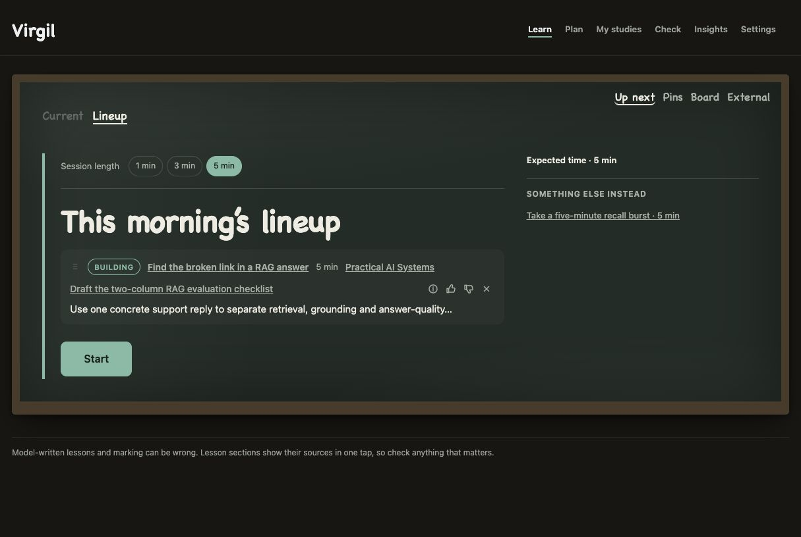
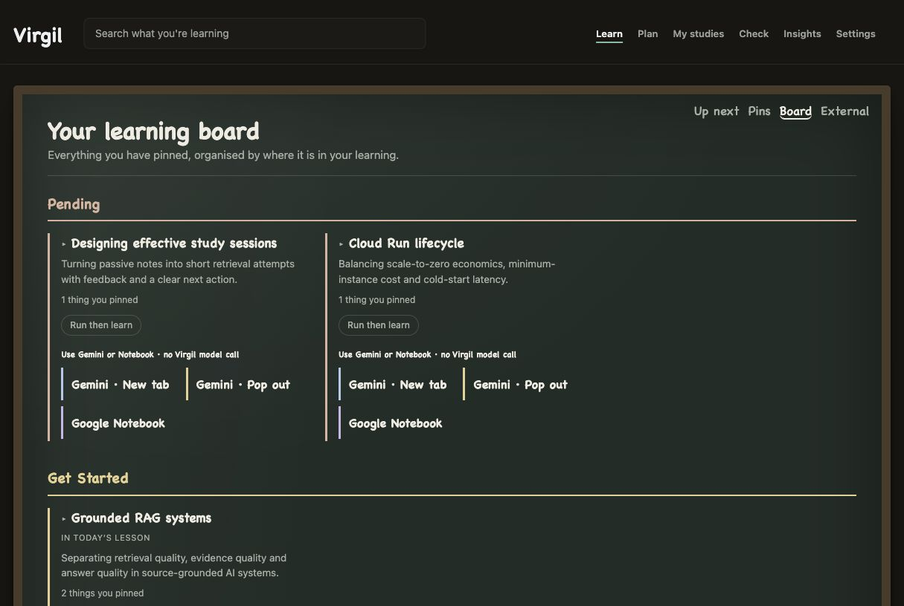

# Virgil

[](https://github.com/bharthamk/virgil/actions/workflows/verify.yml)
[](LICENSE)

**Stop collecting things to learn. Start knowing what to do next.**

Virgil is a source-grounded AI learning companion that stays beside you while
you browse. Pin the exact passage that matters, learn it now or later, and let
every answer, correction, deadline and result improve the next move.



Virgil was conceived, designed and built during the 2026 Google All Things
Agentic Hackathon. It contains no pre-existing product code.

## The problem

Learning rarely arrives as a curriculum. It arrives as saved pages, videos,
course documents, deadlines, unfinished work and feedback scattered across
different tools. Bookmarking saves the source but loses the learning context;
generic chat answers the moment but does not build a durable learner model.

Virgil joins those fragments into one causal loop:

1. **Capture** the exact source, context or outside-learning receipt.
2. **Grow** a learner-owned board through an 11-stage background agent pipeline.
3. **Learn** the smallest useful lesson for the 1, 3 or 5 minutes available.
4. **Manage** courses, commitments, drafts, corrections and outcomes.
5. **Adapt** the next recommendation from the evidence the learner just created.

It is one changing learner state—not a collection of disconnected AI demos.

## What the learner sees

| Surface | Purpose |
| :--- | :--- |
| **Browser extension** | Pin a passage without leaving the page; choose Virgil, Gemini or Google Notebook deliberately. |
| **Up next** | One prepared lesson or action sized to the time available. |
| **Pins and Board** | Inspect raw captures, source receipts and learning state without triggering an unwanted model call. |
| **External** | Record learning that happened elsewhere so it can shape the same board. |
| **Plan and My studies** | Connect learning to courses, material, deadlines and real outcomes. |
| **Check** | Review a draft or mark it criterion-by-criterion without rewriting the learner's work. |
| **Insights** | Separate the learner's own words from Virgil's evidence-backed reads. |



Three principles hold across every surface:

- **No surprise spend.** Pinning is a capture action, not a model call. Paid or
  model-backed work is explicit and budget-gated.
- **No hidden handoff.** Gemini and Google Notebook receive prepared context
  only after the learner chooses the destination.
- **No invented certainty.** Lessons expose sources; an independent verifier
  can withhold unsafe teaching; learner corrections outrank machine reads.

## How the agentic loop works


Interactive agents handle work where someone is waiting: Scout, Tutor,
Reviewer, Marker and Intake Planner. Background agents triage material,
research around sources, build a prerequisite map, detect learner patterns,
propose missing material, refresh the board, compose a session and verify it.
Together, the product exposes a fifteen-agent fleet through ordinary learner
actions rather than an agent showcase disconnected from the work.

The deployed pipeline is deliberately ordered:

```text
intake → forage → cluster → survey → analyse → comfort
       → statements → prospect → garden → compose → verify
```

Only the Forager fans out. Topic partitioning, comfort arithmetic and planning
policy remain deterministic code. Every model call crosses one typed `Llm`
boundary; persistence crosses one `Store`; research crosses one `Research`;
vectors cross one `Embedder`; time is injected through `Clock`. The core imports
no vendor SDK, and the seam check enforces that boundary.

### Google stack

- **Gemini** powers the model-backed agent work through pinned model routes.
- **Google ADK** hosts the ordered background workflow.
- **Cloud Run** serves the product and dispatches a durable per-learner Job.
- **Firestore** holds isolated learner boards and worker receipts.
- **Firebase Authentication** provides Google sign-in without giving Virgil a
  Google password.
- **Google Notebook and Gemini** are explicit learner-controlled destinations,
  not silent exports.

See the [Google backend map](docs/GOOGLE_BACKEND.md) for APIs, identity, IAM,
secrets, failure boundaries and live proof. The
[detailed architecture](docs/architecture-detailed.svg) expands every runtime
boundary.

## Judge quick start

Submission reviewers receive a private, unlinked Demo-mode entrance outside
this repository. It opens the current product over a shared disposable judge
board, without entering the owner's Google account or personal Google
connections.

The repository also includes a public-safe synthetic story that needs no
account and makes no model call:

```bash
npm ci
npm test
node scripts/prepare-judge-story.mjs --out release/judge-story-scratch/store.json
SB_DB=release/judge-story-scratch/store.json node runner/dist/service.js
```

Open `http://127.0.0.1:8791/app/`, then follow:

```text
Up next → Find the broken link in a RAG answer
        → Board → Insights → My studies → Plan → External
```

The story includes three topic states, a sourced RAG lesson, one course with
material, one dated commitment, an External receipt, and both learner-authored
and machine-read insights. Live-model actions stay visibly unavailable until a
model is configured.

## Build and verify

```bash
npm run build          # compile every workspace
npm test               # full deterministic gate
npm run check:quality  # type safety, debt caps and coverage floors
npm run check:public   # credentials and private-data boundary
npm run check:seam     # cross-workspace dependency boundaries
npm run check:d1       # deterministic partition contract
```

`npm test` is the source of truth for the current suite total; the runner prints
passing, failing and explicitly skipped checks rather than freezing a count in
prose.

Container and cloud checks are opt-in. Every deployment script that can create
or bill refuses to run unless `VIRGIL_DEPLOY=yes` is set deliberately. Start a
fresh self-hosted installation with [`INSTALL.md`](INSTALL.md); it gives a
no-write plan before any guarded apply.

## Documentation

| Document | Start here when… |
| :--- | :--- |
| [Product and engineering deep dive](docs/DEEP_DIVE.md) | You want the full product contracts, agent behavior and design rationale formerly held in this README. |
| [Google backend](docs/GOOGLE_BACKEND.md) | You are reviewing the Google architecture, identity chain, model routes or live proof. |
| [Operations](docs/OPERATIONS.md) | You need monitoring, rollback, backup, recovery or connection acceptance. |
| [Release receipt](docs/RELEASE.md) | You need the exact accepted revision, image digests and verification totals. |
| [Installation](INSTALL.md) | You are deploying a new Firebase, Firestore and Cloud Run installation. |

## Current release

The accepted 2026-09-01 release runs the same product surfaces in the extension
and hosted app, backed by Cloud Run, Firestore and the ADK-hosted Job. The
[public release receipt](docs/RELEASE.md) is the source of truth for the exact
revision, deployment and gate totals.

The included Demo state is synthetic. Real learner data, credentials, personal
Google connections and operator configuration are outside the public release
boundary.

## License

Copyright 2026 Benji Hart. Licensed under the
[Apache License 2.0](LICENSE).
