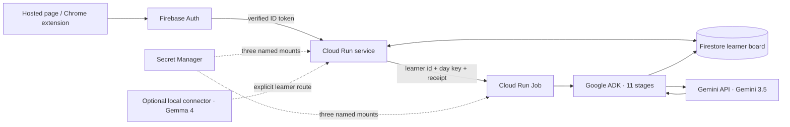

# Google backend engineering

This is the short, source-backed map of Virgil's production backend. It names
the Google services, the exact trust boundaries, the model routes and the
commands that prove a deployment. The longer platform reasoning and historical
risk ledger remain in [`deploy/CLOUD_RUN.md`](../deploy/CLOUD_RUN.md). Day-two
monitoring, rollback, recovery and credential rotation live in
[`OPERATIONS.md`](OPERATIONS.md). The exact currently accepted images, live
execution and residual operator choices are recorded in
[`RELEASE.md`](RELEASE.md).

## Hackathon stack, without inference

The [official All Things Agentic rules](https://allthingsagentichackathon.devpost.com/rules)
require Gemini 3.5+, a Google agent framework and at least one Google Cloud
infrastructure service. They separately reward a successful additional Google
AI model integration and give architectural discipline and production readiness
60% of the Stage Two score. The table below maps those requirements to code,
not submission copy.

| Requirement | Virgil implementation | Source of truth |
| :--- | :--- | :--- |
| Gemini 3.5 or newer through Gemini API or Vertex AI | Both production containers pin `gemini-3.5-flash-lite`; the adapter calls the Gemini API directly | `deploy/service.yaml`, `deploy/job.yaml`, `adapters/src/gemini-llm.ts` |
| Google agent framework | The worker runs all 11 stages inside Google ADK's `SequentialAgent` and `Runner` | `deploy/job.yaml`, `adk/`, `runner/src/hosted-nightly.ts` |
| Google Cloud infrastructure | Cloud Run service + Cloud Run Job + Firestore + Secret Manager + Artifact Registry | `deploy/`, `adapters/src/firestore-store.ts` |
| Additional Google AI model | The selectable local route uses Gemma 4 for fast text work through the authenticated local connector | `adapters/src/ollama-llm.ts`, `runner/src/model-routing.ts`, `runner/src/local-model-connector.ts` |

The mandatory production route and the optional Gemma route are deliberately
separate. The Cloud Run estate does not silently fall back to a local provider,
and selecting Local does not silently spend a Gemini key.

## One request, end to end



1. The hosted page or Chrome extension obtains a Google credential and
   exchanges it with this deployment's Firebase project for a Firebase ID
   token.
2. The Cloud Run service verifies the token's RS256 signature against Google's
   certificates, then checks issuer, audience, lifetime and subject. An Auth
   emulator token is accepted only in an explicitly local emulator mode; a
   deployed process refuses that mode at startup.
3. The verified Firebase subject becomes `learner-<uid>`. Every request opens
   only that learner's Firestore board, and the installation owner/member
   directory is checked before data access.
4. Interactive model work passes through the typed `Llm` port. The deployed
   provider is the Gemini API, with schema translation, response validation,
   refusal handling, timeout handling and token accounting at the adapter
   boundary.
5. Work that should outlive the browser is dispatched to the Cloud Run Jobs API
   with a learner board id, learner-day batch key and receipt id. The service
   account has only the job-level permission needed to execute with those
   overrides.
6. The Job runs the 11 ordered stages inside Google ADK, checkpoints through
   the same Firestore store, independently verifies the session and writes the
   result back to the learner board.

The product has no browser-to-Firestore path. Deployed Firestore rules deny all
client reads and writes; the server-side service account is the only database
principal.

## Google service inventory

| Service/API | Why it exists | Credential boundary |
| :--- | :--- | :--- |
| Cloud Run | Browser-facing API and durable background worker | Firebase protects application data; Cloud Run's browser gate is intentionally reachable |
| Firestore Native | Per-learner state, receipts and async checkpoints | `roles/datastore.user` on the dedicated runtime service account; deny-all client rules |
| Firebase Authentication / Identity Toolkit / Secure Token | Google sign-in and deployment-scoped ID tokens | Public Web API key restricted to those APIs; it is an identifier, not data authority |
| Gemini API (`generativelanguage.googleapis.com`) | Production model calls | Two named Secret Manager secrets, mounted only into the two runtime containers |
| Google ADK | Ordered, restartable agent workflow | Code dependency inside the Job image; no separate network credential |
| Secret Manager | Gemini ladder keys and optional managed Notebook Drive grant | Secret-level accessor bindings only; no project-wide secret role |
| Artifact Registry | Immutable service and Job images | Deployer writes; Cloud Run's managed service agent pulls |
| Cloud Scheduler | Optional fixed-board recovery floor | Off by default; learner actions already dispatch useful work |
| Drive API | Optional managed refresh of three learner-approved Notebook source files | Refresh grant in one named secret; Firestore stores file ids, never the grant |

`deploy/build.sh` enables every API required by the default direct-Gemini
deployment. Vertex AI remains a supported code route, but it is not the shipped
template and the installer does not pre-grant `roles/aiplatform.user`. An
operator choosing `SB_LLM=vertex` must change both templates together, enable
Vertex AI and deliberately add that role.

## Model routing and spend safety

The deployed model spec is explicit in both YAML files:

```text
gemini:gemini-3.5-flash-lite/gemini-3.5-flash-lite
```

The first key is the free arm. Only Gemini capacity responses (429 or 503) may
reach the managed arm; authentication errors, invalid requests, safety refusals
and network failures stay failures. The paid arm is checked by the learner and
operator budget immediately before it can issue a request. Stopped calls are
not recorded as billed calls.

All model results retain the exact `modelId` and input/output token counts. The
Gemini adapter also accounts for thought tokens, translates the fleet's JSON
Schema into the provider's accepted response schema, treats blocked 200
responses as failures rather than empty answers, and never selects a moving
`latest` alias.

The optional Local route is an explicit learner setting. Its shipped fast text
tier is `gemma4:12b-mlx`; deeper text and image work have their own pinned local
models. A short-lived pairing token connects the hosted learner board to the
learner's own model process. The service stores only a token hash and a local
connection receipt, never the local endpoint's credential.

## Identity, IAM and secrets

The default runtime identity is:

```text
virgil-runtime@PROJECT_ID.iam.gserviceaccount.com
```

Its intended authority is exactly:

- project-level `roles/datastore.user`;
- secret-level `roles/secretmanager.secretAccessor` on the three named secrets;
- job-level `roles/run.jobsExecutorWithOverrides` on the Virgil Job.

It does not need Owner, Editor, a project-wide Secret Manager role, Cloud Run
Admin or Vertex AI User for the checked-in direct-Gemini route. The production
Job also refuses the fixture-only `seed` command against Firestore unless a
second, command-specific destructive opt-in is present.

The hosted page is intentionally not protected by Cloud Run IAM: browsers carry
Firebase ID tokens, not Cloud Run identity tokens. Disabling the outer invoker
check lets the request reach the application; it does not authorize a learner.
Every data route still requires a verified Firebase token and membership.
`/health` is the only anonymous, data-free route.

## Firestore safety

`deploy/apply.sh` creates the default Native database when absent, publishes
the checked-in deny-all rules before either runtime, and enables database delete
protection. Point-in-time recovery is left to the operator because it changes
the storage bill; learner backup/restore remains a product-level path.

Store writes use bounded batches and transactions where a read-modify-write
decision must survive concurrency. The service is capped at one instance and
two concurrent requests until whole-board concurrency is moved entirely behind
transactional updates. Raising either value is an architecture change, not a
scaling tweak.

## Deployment and proof

Start with read-only rendering:

```bash
PROJECT_ID=your-project ./deploy/build.sh --plan
PROJECT_ID=your-project \
FIREBASE_API_KEY=your-public-web-api-key \
GOOGLE_WEB_CLIENT_ID=your-web-client-id \
OWNER_EMAIL=owner@example.com \
./deploy/apply.sh --plan
```

Then follow [`INSTALL.md`](../INSTALL.md). A release is not accepted until the
following agree:

- service and Job images were built from the same source and carry the same
  release tag;
- both YAML templates resolve every placeholder and select the same Firestore
  project, model spec and three secret names;
- deny-all Firestore rules are the active release;
- the runtime IAM set contains the three bounded authorities above and no stale
  broader binding;
- service and Job are Ready, the service sends 100% traffic to the intended
  revision, `/health` is green and an anonymous data request is 401;
- one authenticated learner can write and reload their own board while a second
  learner cannot see it;
- one Job execution reaches a terminal success receipt through Google ADK,
  Gemini and Firestore;
- `npm test`, `npm run check:quality`, `npm run check:seam`, `npm run check:d1`
  and the container smoke test are green.

Useful read-only live checks:

```bash
gcloud run services describe virgil-service --region us-central1 --project PROJECT_ID
gcloud run jobs describe virgil-nightly --region us-central1 --project PROJECT_ID
gcloud firestore databases describe --database='(default)' --project PROJECT_ID
gcloud projects get-iam-policy PROJECT_ID
gcloud secrets list --project PROJECT_ID
gcloud logging read 'resource.type=("cloud_run_revision" OR "cloud_run_job") AND severity>=ERROR' \
  --project PROJECT_ID --limit 50
```

Never print a secret version as an acceptance step. Prove the binding, mount and
successful provider call instead.

The current synchronized estate and its exact operations audit are recorded by
the annotated release tag named in [`RELEASE.md`](RELEASE.md). That receipt
deliberately does not turn the optional local Gemma contract into a production
round-trip claim.
